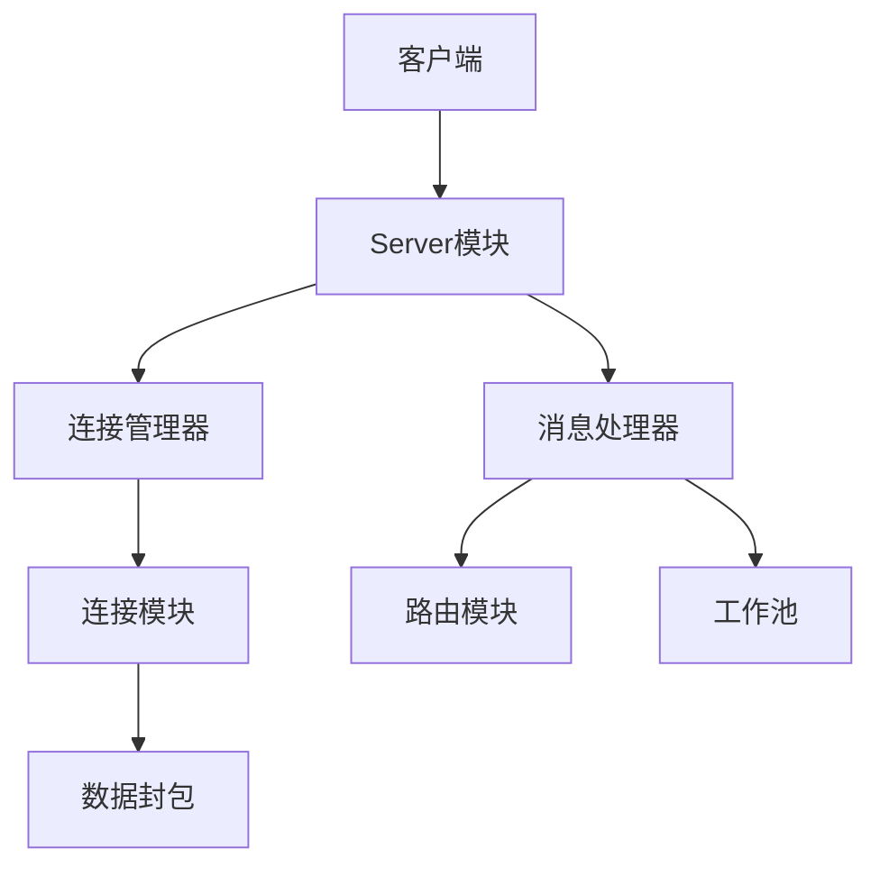

# Zinx Framework

Zinx是一个轻量级的TCP服务器框架，基于Golang开发。它提供了简单易用的API，帮助开发者快速构建高性能的网络应用。

## 框架特性

- 轻量级TCP框架
- 模块化设计
- 高性能
- 简单易用
- 高度可扩展

## 核心功能

- 连接管理(Connection Management)
- 消息路由(Message Router)
- 请求处理(Request Handler)
- 数据封包(Data Pack)
- 工作池(Worker Pool)
- Hook机制(Connection Hooks)
- 属性管理(Property Management)

## 框架架构



## 快速开始

### 1. 创建服务器

```go
// 创建服务器
s := znet.NewServer("ZinxServer")

// 启动服务
s.Serve()
```

### 2. 实现路由

```go
// 自定义路由
type MyRouter struct {
    znet.BaseRouter
}

// 处理业务
func (r *MyRouter) Handle(request ziface.IRequest) {
    // 处理消息
    fmt.Println("收到消息: ", string(request.GetData()))
    
    // 回复消息
    request.GetConnection().SendMsg(1, []byte("Hello Zinx Client"))
}

// 注册路由
s.AddRouter(1, &MyRouter{})
```

### 3. 配置服务器

在`conf/zinx.json`中配置:

```json
{
    "Name": "ZinxServer",
    "Host": "127.0.0.1",
    "TcpPort": 7777,
    "MaxConn": 3,
    "WorkerPoolSize": 10,
    "MaxWorkerTaskLen": 1024,
    "MaxMsgChanLen": 1024
}
```

## 高级特性

### 连接Hook

```go
// 连接建立时的Hook
func OnConnectionStart(conn ziface.IConnection) {
    fmt.Println("新连接建立")
}

// 连接断开时的Hook
func OnConnectionStop(conn ziface.IConnection) {
    fmt.Println("连接断开")
}

// 注册Hook
s.SetOnConnStart(OnConnectionStart)
s.SetOnConnStop(OnConnectionStop)
```

### 连接属性

```go
// 设置属性
conn.SetProperty("name", "zinx")

// 获取属性
name, err := conn.GetProperty("name")

// 移除属性
conn.RemoveProperty("name")
```

## 性能优化

- 工作池处理业务逻辑
- 读写分离设计
- 消息队列缓冲
- 连接池管理
- TCP粘包处理

## 使用建议

1. 合理配置工作池大小和任务队列长度
2. 注意处理连接的生命周期
3. 合理设置消息包大小限制
4. 善用Hook机制和属性管理
5. 注意异常处理和错误恢复

## 贡献

欢迎提交Issue和Pull Request来完善框架。

## 许可证

MIT License

